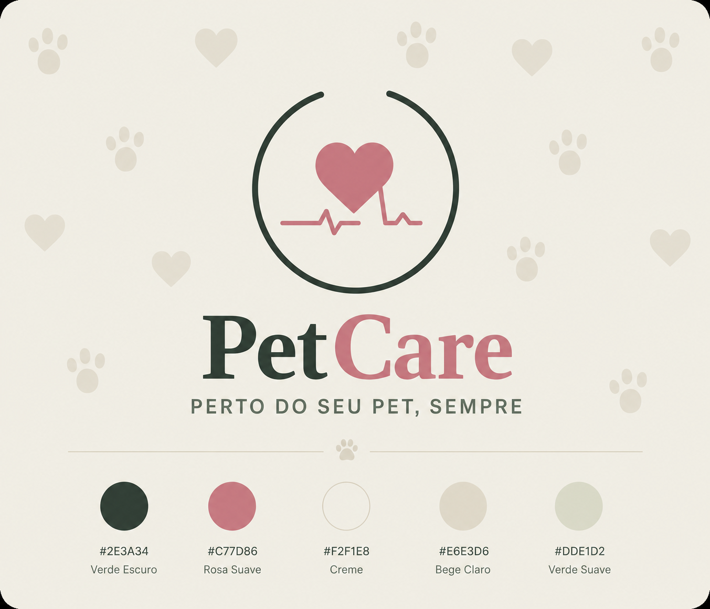

<p align="center">
  
</p>

<h1 align="center">🐾 PetCare</h1>

<p align="center">
  Sistema para gerenciamento da saúde e bem-estar de animais de estimação.
</p>

<p align="center">


</p>

---

# 📖 Sobre o Projeto

O **PetCare** é uma plataforma desenvolvida para auxiliar tutores no gerenciamento da saúde de seus animais de estimação.

A aplicação centraliza informações importantes como vacinação, consultas veterinárias, medicamentos, alergias e compromissos, oferecendo uma experiência simples, organizada e acessível.

Além da implementação da aplicação, o projeto foi concebido utilizando práticas de Engenharia de Software, abrangendo documentação de produto, requisitos, análise, arquitetura, design e desenvolvimento.

---

# ✨ Funcionalidades

- 👤 Cadastro e autenticação de usuários
- 🐶 Cadastro de múltiplos pets
- 💉 Controle de vacinação
- 🩺 Histórico de consultas veterinárias
- 💊 Gerenciamento de medicamentos
- ⚠️ Registro de alergias
- 📅 Agenda de eventos e lembretes
- 👤 Gerenciamento de perfil

---

# 🏛 Arquitetura

A aplicação segue uma arquitetura em camadas, promovendo separação de responsabilidades, baixo acoplamento e facilidade de manutenção.

```text
Frontend (React)

        │

    REST API

        │

Backend (Go + Echo)

        │

    MongoDB
```

Principais características:

- Arquitetura em Camadas
- API REST
- JWT Authentication
- MongoDB
- Componentização
- Design System
- Documentação completa

---

# 🛠 Tecnologias

## Frontend

- React
- TypeScript
- Vite
- React Router
- Axios

## Backend

- Go
- Echo Framework
- JWT
- REST API

## Banco de Dados

- MongoDB

## Ferramentas

- Git
- GitHub
- Docker
- Figma

---

# 📂 Estrutura do Projeto

```text
PetCare
│
├── docs/
│   ├── 00-Product/
│   ├── 01-Requirements/
│   ├── 02-Analysis/
│   ├── 03-Architecture/
│   ├── 04-Design/
│   └── 05-Development/
│
├── frontend/
│
├── backend/
│
└── README.md
```

---

# 📚 Documentação

Toda a documentação do projeto está organizada em módulos.

| Pasta | Conteúdo |
|--------|-----------|
| **00-Product** | Visão do produto, personas, jornada do usuário e MVP |
| **01-Requirements** | Requisitos funcionais, não funcionais, regras de negócio e histórias de usuário |
| **02-Analysis** | Modelagem do domínio, casos de uso e diagramas |
| **03-Architecture** | Arquitetura do sistema, API, banco de dados, segurança e ADRs |
| **04-Design** | Design System, identidade visual, componentes e fluxos |
| **05-Development** | Diretrizes de desenvolvimento, frontend, backend, testes e deploy |

---

# 🚀 Como Executar

## Clone o projeto

```bash
git clone https://github.com/seu-usuario/petcare.git
```

```bash
cd petcare
```

---

## Backend

```bash
cd backend

go mod tidy

go run .
```

---

## Frontend

```bash
cd frontend

npm install

npm run dev
```

---

# 📌 Roadmap

### MVP

- [x] Planejamento do Produto
- [x] Documentação
- [ ] Autenticação
- [ ] Cadastro de Pets
- [ ] Vacinas
- [ ] Consultas
- [ ] Medicamentos
- [ ] Agenda
- [ ] Perfil

### Futuras versões

- [ ] Upload de documentos
- [ ] Compartilhamento com veterinários
- [ ] Notificações
- [ ] Aplicativo Mobile
- [ ] Multiusuários
- [ ] Dashboard de saúde
- [ ] IA para recomendações

---

# 🎯 Objetivos do Projeto

Este projeto foi desenvolvido com o objetivo de aplicar conceitos de:

- Engenharia de Software
- Arquitetura de Software
- Desenvolvimento Full Stack
- Boas práticas de programação
- Documentação técnica
- Design de Produto
- APIs REST
- UX/UI
- Gestão de projetos

---

# 🤝 Contribuição

Contribuições são bem-vindas.

Caso deseje contribuir:

1. Faça um Fork do projeto.
2. Crie uma branch para sua feature.
3. Realize as alterações.
4. Envie um Pull Request.

---

# 📄 Licença

Este projeto está licenciado sob a licença **MIT**.

---

# 👩‍💻 Autora

**Beatriz França**

Software Engineer

- GitHub: https://github.com/afbeah
- LinkedIn: https://www.linkedin.com/in/afbeah/

---

<p align="center">
Desenvolvido com ❤️ para tornar o cuidado com os pets mais simples, organizado e acessível.
</p>
